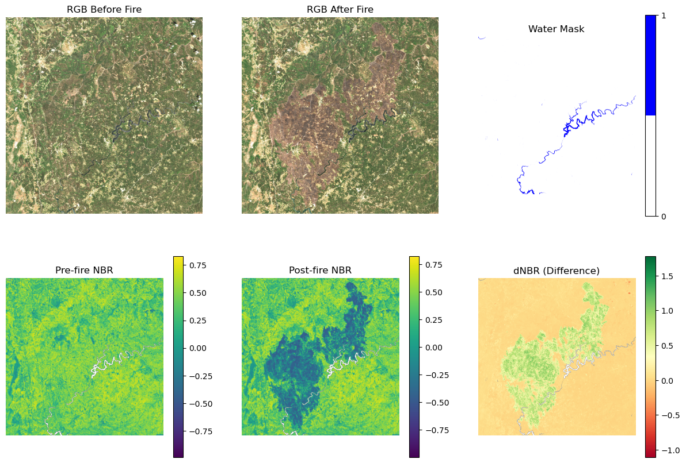

# Automated Burn Area Detection and Vegetation Recovery Analysis using Sentinel-2

## Project Description & Objective

This project aims to **automatically detect and mask burned areas** and **visualize post-fire vegetation recovery** using **Sentinel-2 satellite imagery**.  
As a case study, the project analyzes a **wildfire event in Portugal (July 2017)**.

The analysis is based on the **Normalized Burn Ratio (NBR)** and its difference, the **Delta NBR (dNBR)**, to classify burned areas and assess burn severity.  
Furthermore, vegetation recovery over subsequent years is examined using **NDVI** and **NBR** indices.

---

## Burn Ratio Calculations

### **Normalized Burn Ratio (NBR)**

\[
NBR = \frac{(NIR - SWIR)}{(NIR + SWIR)}
\]

Burned areas exhibit **low NIR** and **high SWIR** reflectance.  
→ **High NBR** = healthy vegetation  
→ **Low NBR** = bare soil or recently burned surfaces  

---

### **Delta Normalized Burn Ratio (dNBR)**

\[
dNBR = NBR_{pre-fire} - NBR_{post-fire}
\]

A higher **dNBR** indicates more severe fire damage, while **negative values** may suggest vegetation regrowth.

A **burn mask** is derived using a **threshold of 0.1** (Keeley, 2009).  
For the affected region, annual **NDVI** and **NBR** are computed to illustrate vegetation recovery.  
Water (**NDWI**) and cloud (**SCL layer**) masks are applied to ensure accurate analysis.

The workflow is designed to be **easily adaptable to other wildfire regions**.

---

## Workflow Overview

1. **Download Sentinel-2 scenes** using [cubo](https://cubo.readthedocs.io/en/latest/).  
2. **Load and visualize** pre-fire and post-fire scenes.  
3. **Compute NBR and dNBR** and create a **burn severity classification map**.  
4. **Generate a burn mask** from dNBR (threshold = 0.1).  
5. **Load Sentinel-2 scenes** for each **July** (month of the fire) from **2015–2024**.  
6. **Apply water and cloud masks** (NDWI and SCL layers).  
7. **Calculate maximum NDVI and NBR** for each year.  
8. **Compute annual dNBR** as the difference between current and previous year’s maximum NBR.  
9. **Visualize NDVI, NBR, and dNBR** trends over time.

    


---

## Results

**Figure 1:** Development of NDVI, NBR, and dNBR from 2015 to 2024.

- In **2017**, NDVI and NBR drop sharply, correlating with burned areas.  
- **High dNBR** values in 2017 indicate severe fire damage.  
- From **2018 onward**, NDVI and NBR recover, reflecting vegetation regrowth.  
- **Negative dNBR** values after 2018 confirm regeneration.  
- In **2022**, a noticeable decline suggests a new disturbance such as drought or another fire.

---

## Required Packages

The following Python packages are required:

```bash
numpy
matplotlib
cubo
xarray
cartopy
mpl_toolkits
